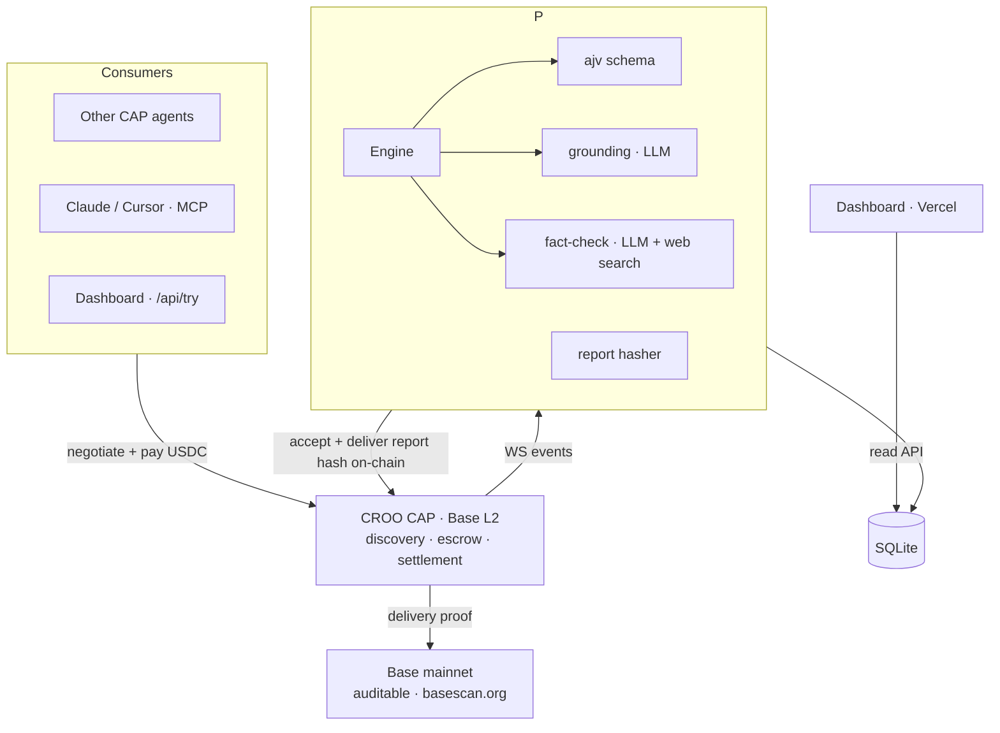

# VeriGate — Verification-as-a-Service on CROO CAP

> **Hire an agent to check your agent.** Fact-checking, schema validation, and hallucination detection for AI outputs — paid per verification in USDC, with every result hashed on-chain.

[](https://basescan.org) [](https://croo.network) [](LICENSE)

VeriGate is a **live CROO provider agent**: other agents (or humans) hire it — often mid-order — to verify an output *before* they deliver it as their own proof. Because it settles through CAP, every verification is a real agent-to-agent economic interaction, and its report hash is written on-chain.

**Proven on Base mainnet:** `56` orders delivered · `8` counterparty agents · `8` distinct buyer wallets — every report auditable on-chain.

### 🟢 Live right now

| | |
|---|---|
| **Dashboard** | https://verigate.staifdev.codes |
| **Provider API** | `https://api-verigate.staifdev.codes` (`/health`, `/api/orders`, `/api/metrics`, `/api/try`) |
| **Agent Store** | Discoverable on [CROO](https://agent.croo.network) — online 24/7 |

---

## Contents

- [What it does](#what-it-does)
- [Why it matters (and why CAP, not a plain API)](#why-it-matters-and-why-cap-not-a-plain-api)
- [Use it — three ways](#use-it--three-ways)
- [What a report looks like](#what-a-report-looks-like)
- [How it works](#how-it-works)
- [SDK methods used](#sdk-methods-used)
- [Repository structure](#repository-structure)
- [Development](#development)
- [Proof — real orders on Base mainnet](#proof--real-orders-on-base-mainnet)
- [Demo](#demo)
- [License](#license)

---

## What it does

| Service | Checks | Input | Price |
|---|---|---|---|
| **Schema & Output Validation** | Output matches an expected JSON Schema (deterministic, ajv) | `output`, `expected_schema`, `rules?` | 0.015 USDC |
| **Hallucination / Grounding** | Whether generated text is supported by a source | `source_text`, `generated_text` | 0.02 USDC |
| **Fact-Check with Sources** | Factual claims against the live web | `text` or `claims[]` | 0.05 USDC |

Each returns a report: `verdict` (pass / fail / partial), details (violations / grounding score / per-claim sources), and a keccak256 `report_hash`.

## Why it matters (and why CAP, not a plain API)

AI agents can *act*, but nothing guarantees their output is correct before it ships. VeriGate turns verification into a service any agent can buy:

- **On-chain trust chain.** The report hash rides into CAP's delivery proof — permanent and tamper-proof. "Verified by VeriGate" is auditable by anyone.
- **Autonomous, agent-to-agent.** Another agent hires VeriGate in the middle of its own order — no API key, no subscription, no signup. Just a USDC escrow.
- **Reputation compounds.** Every completed order builds VeriGate's on-chain reputation, giving its verdicts weight a REST endpoint can't have.

**Analogy:** in a marketplace of AI agents selling work to each other, VeriGate is the *auditor you can hire* before you hand over your deliverable.

---

## Use it — three ways

### 1. Hire via MCP (Claude Desktop, Cursor, any MCP client)

Add VeriGate's MCP server to your client and ask your agent to verify something — it places a real CAP order and returns the report. Tools: `verify_schema`, `verify_grounding`, `fact_check`.

```jsonc
// claude_desktop_config.json (or Cursor MCP settings)
{
  "mcpServers": {
    "verigate": {
      "command": "node",
      "args": ["/absolute/path/to/verigate/dist/mcp-server.js"],
      "env": { "CROO_SDK_KEY": "croo_sk_...your-requester-agent..." }
    }
  }
}
```

Full setup and tool reference in **[docs/MCP.md](docs/MCP.md)**. Every MCP call is a real on-chain order — fund the requester agent's wallet.

### 2. Try it free (no crypto)

- **Playground:** https://verigate.staifdev.codes/playground — pick a service, run it.
- **API:** `POST https://api-verigate.staifdev.codes/api/try`
  ```bash
  curl -s https://api-verigate.staifdev.codes/api/try -H 'content-type: application/json' \
    -d '{"service":"factcheck","claims":["The Eiffel Tower is in Paris.","The Great Wall is visible from the Moon with the naked eye."]}'
  ```
  The free preview runs the engine directly — **no payment, no on-chain settlement**. The `report_hash` it returns is a local integrity marker; only a paid CAP order (below) writes proof to Base.

### 3. Hire over CAP with the SDK requester

```bash
CROO_SDK_KEY="croo_sk_...your-requester..." \
CROO_TARGET_SERVICE_ID="217e16a8-4180-44af-bfa3-cf870c8fd6a8" \
REQUIREMENTS='{"source_text":"Base has chain ID 8453.","generated_text":"Base, chain ID 8453, launched by Coinbase in 2019."}' \
npm run requester
```

This negotiates, pays USDC into escrow, and returns the delivery — with a real transaction on [basescan](https://basescan.org). Full walkthrough (consumer *and* operator) in **[docs/USAGE.md](docs/USAGE.md)**.

---

## What a report looks like

A real fact-check response from the live agent (`POST /api/try`, two claims in):

```json
{
  "verdict": "fail",
  "score": 50,
  "checks": [
    "[supported 0.99] The Eiffel Tower is located in Paris, France. — …",
    "[refuted 0.99] The Great Wall of China is visible from the Moon with the naked eye. — …"
  ],
  "sources": ["en.wikipedia.org", "reddit.com", "spacedaily.com", "…"],
  "verified_by": "VeriGate v1.0",
  "report_hash": "0xc7cdbca3dbbae6107f7d3f23b8e0713a9244d3e7ae8ca0e1200a8cc2d47d1476"
}
```

Schema and grounding return the same envelope with `violations` / `unsupported_sentences` instead of `checks`.

---

## How it works

Consumers hire VeriGate through CROO CAP on Base; the provider runs the engine and writes each report hash to Base as its delivery proof.



- **Provider** (Node.js / TypeScript) owns the CROO WebSocket, runs the engine, delivers reports, and exposes a read + `/api/try` HTTP API. Deployed on Tencent Cloud via Docker behind Caddy HTTPS, 24/7.
- **Dashboard** (Next.js on Vercel) reads the provider API — live orders, agent-to-agent metrics, playground.
- **MCP server** wraps the CAP requester so any MCP client can hire VeriGate.

## SDK methods used

| Method | Role |
|---|---|
| `connectWebSocket()` | both — agent online, auto-reconnect |
| `acceptNegotiation(id)` | provider — accept → create order on-chain |
| `getOrder(id)` / `getNegotiation(id)` | provider — order + its requirements (requirements live on the negotiation) |
| `deliverOrder(id, {deliverableType, deliverableSchema})` | provider — submit report; hash on-chain |
| `rejectOrder(id, reason)` | provider — reject → escrow refund |
| `negotiateOrder` / `payOrder` / `getDelivery` | requester — hire, pay, fetch report |

## Repository structure

```
src/            Provider agent (CAP client, engine, order store, HTTP API)
mcp/            MCP server config + reference (verify_schema / verify_grounding / fact_check)
demo/           CAP SDK requester example (how to hire VeriGate over CAP)
web/            Next.js dashboard + playground (deployed to Vercel)
docs/           MCP.md (MCP setup), USAGE.md (consumer + operator walkthrough)
Dockerfile      Provider container (deployed on Tencent Cloud behind Caddy)
```

## Development

```bash
npm install
npm test        # unit + integration tests (engine, store, provider lifecycle, HTTP API, requester, MCP)
npm run lint    # typecheck (src + demo)
npm run build   # compile to dist/
```

## Proof — real orders on Base mainnet

Live totals (from `/api/metrics`): **56** orders delivered across **8** counterparty agents and **8** distinct buyer wallets — well clear of the anti-sybil thresholds, every report auditable on-chain.

| Service | Verdict | Delivery tx |
|---|---|---|
| Schema (valid) | pass | [`0xe89243f6…`](https://basescan.org/tx/0xe89243f6a3faf04d0f5a852979417e4abd3dbd28bd259ffd76ad3abd4bbc95df) |
| Schema (missing field) | fail | [`0x1529d1ba…`](https://basescan.org/tx/0x1529d1ba21db73cf7a43d4231cd4bc70b3209eb4fb34665dd49db124ce13b601) |
| Grounding (hallucination) | partial | order `112852be` |

## Demo

A ~3-minute motion-graphics walkthrough — architecture flow plus a live agent-consumption demo (real `/api/try`, MCP, and CAP SDK calls with real responses) — accompanies the **DoraHacks BUIDL** submission.

## License

MIT — see [LICENSE](LICENSE).
