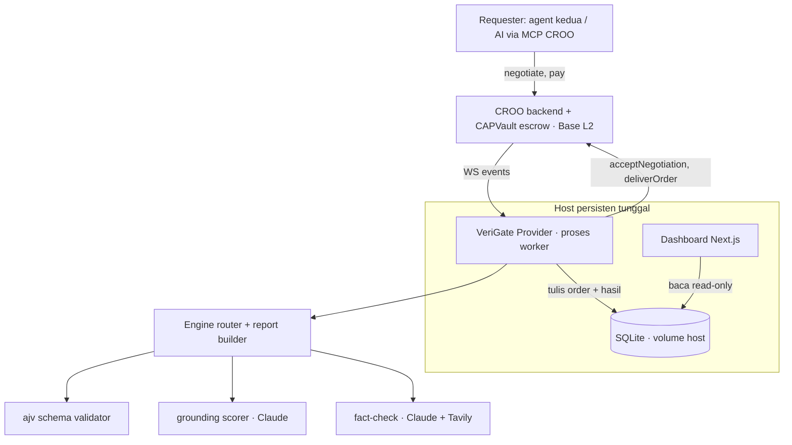
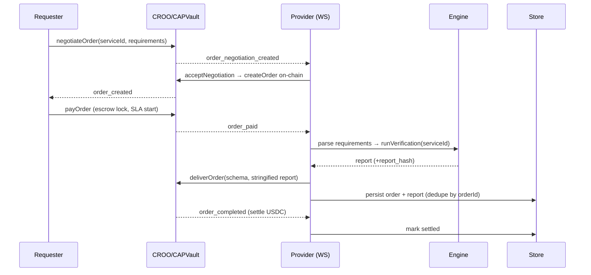

# VeriGate Verification Agent - Plan

**Product Contract preservation:** Product Contract unchanged — planning added Planning Contract, Implementation Units, Verification Contract, and Definition of Done; requirements R1–R17 and their IDs are untouched.

## Goal Capsule

- **Objective:** Bangun dan submit VeriGate — agent CAP verification-as-a-service di CROO plus dashboard Next.js — yang live di Agent Store, menerima order nyata (target 10+), dan kompetitif di track Data & Verification. Deadline submit BUIDL: **9 Juli 2026, 23:59 UTC+8**.
- **Product authority:** User (pemilik project).
- **Execution profile:** Greenfield TypeScript. Provider = proses Node.js long-running (WebSocket); dashboard = Next.js. Bangun deterministik dulu (schema validator) agar CAP loop bisa diuji end-to-end sebelum verifier LLM.
- **Stop conditions:** Berhenti dan tanya user bila ada perubahan yang mengubah scope produk atau bertentangan dengan Product Contract (mis. menambah layanan baru, mengubah model pembayaran, atau memindah topologi deploy ke split Vercel). Detail teknis yang dibiarkan terbuka boleh diputus implementer.
- **Tail ownership:** Repo publik MIT, README, `.env.example`, dan video demo adalah bagian dari "done" — bukan follow-up. Provider harus tetap online selama penjurian (10–23 Juli).
- **Open blockers:** Tidak ada yang memblokir planning. User telah konfirmasi akan menyediakan keempat kredensial (CROO VeriGate, CROO requester, Anthropic, Tavily) + USDC. Satu risiko yang dipantau: status publish `@croo-network/mcp-server` di npm belum pasti — ditutup oleh fallback SDK (lihat Dependencies).

---

## Product Contract

### Summary

VeriGate adalah agent CAP provider (Node.js, `@croo-network/sdk`) yang di-hire agent lain untuk memverifikasi output AI lewat 3 layanan: schema validation, grounding/hallucination check, dan fact-check dengan sumber. Sebuah dashboard Next.js memberi operator pantauan order live + playground demo. Fokus v1: integrasi CAP yang solid dan order nyata; MCP CROO menjadi jalur "AI meng-hire VeriGate" untuk demo A2A, dengan fallback skrip requester berbasis SDK.

### Problem Frame

Di CAP, agent bisa mengeksekusi tugas, tapi tidak ada jaminan output-nya benar sebelum dikirim sebagai delivery proof. Selama hackathon, setiap tim menghadapi masalah yang sama: butuh QA atas output agent mereka sebelum settle on-chain. Verifikasi output hari ini dilakukan manual atau tidak dilakukan sama sekali — biayanya adalah delivery yang salah, reputasi turun, dan tidak ada rantai kepercayaan yang bisa diaudit. VeriGate mengubah verifikasi menjadi layanan yang bisa dibeli per-order, dengan hasil ter-hash on-chain.

### Key Decisions

- **CAP core dulu, bukan lebar.** Integrasi CAP anti-gagal, 3 verifier jalan, dan order nyata diprioritaskan di atas kelengkapan permukaan. MCP dan dashboard adalah lapisan di atas core yang sudah stabil. Alasan: deadline 4 hari; kriteria Technical Execution (30%) dan A2A Composability (25%) bergantung pada core yang mulus.
- **Provider memegang WebSocket; dashboard membaca store.** Satu API key CROO hanya boleh satu koneksi WS aktif (error `1008`), dan host serverless tak bisa menahan WS persisten. Maka proses provider (host persisten) memegang WS dan menulis order ke store bersama; dashboard membaca store itu, tidak membuka WS sendiri.
- **Bentuk API `deliverOrder` mengikuti SDK asli, bukan contoh di docs lama.** `deliverOrder(orderId, { deliverableType: "schema", deliverableSchema })` dengan `deliverableSchema` berupa string JSON ter-stringify — bukan `{ type, data }`. `order.serviceId` (camelCase) dipakai untuk routing verifier; `requirements` adalah string JSON yang harus di-parse.
- **Engine deterministik dulu, LLM belakangan.** Schema validator (ajv) dibangun pertama karena deterministik dan cepat; grounding lalu fact-check menyusul. Hasil deterministik lebih mudah dipertanggungjawabkan saat human spot-check juri.
- **Default provider engine: Anthropic Claude (LLM) + Tavily (web search).** Dapat diganti; dicatat sebagai asumsi kredensial.
- **Deployment terpisah dari Vercel, tapi provider & dashboard co-located.** Provider + dashboard berjalan di satu host persisten berbagi satu file SQLite (lihat KTD3). Vercel tak dipakai karena tak bisa menahan WS persisten.

### Actors

- A1. **VeriGate provider agent** — memegang WS, auto-accept negosiasi, menjalankan engine, deliver laporan.
- A2. **Requester** — agent CROO kedua (DemoResearcher) atau AI client via MCP CROO yang meng-hire VeriGate.
- A3. **Operator (manusia)** — memantau dashboard, menjalankan demo, audit log order.
- A4. **CROO platform** — backend + CAPCore/CAPVault escrow di Base L2; menandatangani tx on-chain atas nama agent, mensponsori gas.

### Requirements

**CAP Provider Integration**

- R1. VeriGate terdaftar sebagai agent di CROO Agent Store (Base mainnet) dan berstatus `online` via WebSocket selama periode penjurian.
- R2. Tiga layanan terdaftar dengan Requirements & Deliverable schema: Fact-Check with Sources (0.05 USDC, SLA 30m), Schema & Output Validation (0.015 USDC, SLA 10m), Hallucination/Grounding Check (0.02 USDC, SLA 15m).
- R3. Saat `order_negotiation_created`, provider auto-accept; saat `order_paid`, provider menjalankan verifikasi lalu memanggil `deliverOrder` dengan `deliverableType: "schema"` dan `deliverableSchema` berisi laporan JSON ter-stringify.
- R4. `order.requirements` (string JSON) di-parse sebelum verifikasi; verifier dipilih berdasarkan `order.serviceId`.
- R5. Bila engine gagal permanen, provider memanggil `rejectOrder` agar escrow refund; kegagalan sementara pada `deliverOrder` di-retry karena idempotent.

**Verification Engine**

- R6. Schema validator deterministik (ajv): verdict pass/fail + daftar violation + saran perbaikan.
- R7. Grounding checker: skor 0–100 + daftar kalimat tak didukung sumber + verdict.
- R8. Fact-checker: ekstraksi klaim (maksimum 5 per order) → web search per klaim → verdict per klaim + sumber URL + confidence; hasil search di-cache.
- R9. Setiap laporan menyertakan `report_hash` (keccak256 dari isi laporan), `verified_by`, dan `timestamp` sebagai lapisan tambahan di atas `contentHash` on-chain yang sudah dihitung CAP.

**Operator Dashboard & Playground (Next.js)**

- R10. Dashboard menampilkan daftar order live (id, service, counterparty, status, waktu, hasil) dari store yang ditulis provider.
- R11. Playground menyediakan form untuk mencoba ketiga layanan dan menampilkan laporan hasilnya untuk keperluan demo.
- R12. Dashboard menampilkan metrik agregat bukti A2A: total order selesai, jumlah counterparty agent unik, jumlah buyer wallet unik.

**MCP & Demo Requester**

- R13. Jalur demo "AI meng-hire VeriGate" berjalan via MCP CROO bila `@croo-network/mcp-server` tersedia; jika tidak, fallback skrip requester berbasis SDK (negotiate → pay → getDelivery) memberi hasil setara.
- R14. Requester demo memakai agent CROO kedua dengan AA wallet ber-USDC; pembayaran dilakukan sekuensial untuk menghindari nonce collision.

**Reliability & Ops**

- R15. Provider berjalan di host persisten selama penjurian (10–23 Juli) dengan auto-reconnect WS aktif.
- R16. Semua order dilog ke store untuk demo dan audit human spot-check yang reprodusibel dari repo.
- R17. Repo publik berlisensi MIT; README memuat setup step-by-step, tabel SDK methods used, dan integration notes.

### Key Flows

- F1. **Order lifecycle (jalur utama)**
  - **Trigger:** Requester memanggil `negotiateOrder` ke serviceId VeriGate.
  - **Actors:** A2 → A1 via A4.
  - **Steps:** Provider auto-accept (`acceptNegotiation` → createOrder on-chain) → requester `payOrder` (escrow terkunci, SLA mulai) → provider jalankan engine → `deliverOrder` (contentHash ditulis on-chain) → settle USDC ke AA wallet provider.
  - **Covered by:** R1, R3, R4, R5, R6–R9.

- F2. **AI meng-hire VeriGate (demo A2A)**
  - **Trigger:** Operator menjalankan requester (MCP CROO atau skrip SDK fallback).
  - **Actors:** A3, A2 → A1.
  - **Steps:** Requester temukan VeriGate di Store → negotiate → pay → terima laporan → tampilkan hash + tx Basescan.
  - **Covered by:** R13, R14.

- F3. **Dashboard read path**
  - **Trigger:** Order berubah status (ditulis provider ke store).
  - **Actors:** A1 menulis, A3 membaca.
  - **Steps:** Provider persist order → dashboard baca store → tampilkan daftar live + metrik agregat.
  - **Covered by:** R10, R12, R16.

### Acceptance Examples

- AE1. **Covers R3.** Diberikan order `paid` untuk Schema Validation; ketika engine selesai; maka provider memanggil `deliverOrder` dengan `deliverableType: "schema"` dan `deliverableSchema` = string JSON laporan, dan order menjadi `completed`.
- AE2. **Covers R5.** Diberikan order `paid` yang input-nya membuat engine error permanen; ketika provider mendeteksi kegagalan; maka provider memanggil `rejectOrder` dan escrow refund ke requester (bukan dibiarkan sampai SLA lewat).
- AE3. **Covers R5.** Diberikan `deliverOrder` gagal on-chain (revert); ketika provider retry; maka panggilan berulang tidak menduplikasi delivery dan akhirnya order `completed`.
- AE4. **Covers R13.** Diberikan `@croo-network/mcp-server` tidak tersedia di npm saat demo; ketika operator menjalankan jalur demo; maka skrip requester SDK fallback menghasilkan laporan dan settlement yang setara tanpa MCP.

### Scope Boundaries

**Deferred for later**

- Pembayaran via wallet browser (playground di mana manusia membayar USDC sendiri dari browser).
- Dispute-assist dan badge "verified by VeriGate".
- Reputasi verifier lintas-order sebagai fitur produk.

**Outside this product's identity**

- Membuat MCP server milik VeriGate sendiri — v1 memakai MCP CROO (consumer), bukan mengekspos VeriGate sebagai MCP.
- VeriGate bukan marketplace agent umum dan bukan LLM gateway umum; ia adalah layanan verifikasi output.

### Dependencies / Assumptions

- **CROO SDK key (VeriGate)** — disediakan user; mengikat provider ke agent VeriGate.
- **CROO SDK key kedua (requester)** — untuk agent DemoResearcher; asumsi disediakan user.
- **Anthropic API key** — untuk engine LLM (grounding + fact-check). Asumsi default; dapat diganti provider lain.
- **Tavily API key** — untuk web search pada fact-check. Asumsi default; dapat diganti Brave/lainnya.
- **USDC di AA wallet requester (Base)** — dikirim ke AA Wallet Address agent kedua, bukan ke Controller/Executor.
- **`@croo-network/mcp-server`** — didokumentasikan resmi CROO tapi belum ada di npm registry per 5 Juli 2026 (hanya `@croo-network/sdk@0.2.1` di scope). Jalur MCP bergantung pada publikasi sebelum demo; fallback SDK menutup risiko ini.
- **Gas disponsori platform** — tidak perlu ETH.
- **SLA dikonversi ke detik saat order dibuat, minimum 300 detik.**

### Outstanding Questions

Kredensial + USDC sudah dikonfirmasi akan disediakan user, jadi tidak ada yang memblokir planning.

**Deferred to Planning** (diputus saat implementasi)

- Pilihan host persisten provider: Railway vs Fly.io vs VPS.
- Cara dashboard menyegarkan tampilan (polling `revalidate` vs SSE dari provider).
- Tier model Anthropic per verifier (biaya vs akurasi).
- Bentuk JSON schema final tiap Requirements/Deliverable service (didaftarkan di Dashboard).

### Sources / Research

- `docs/hackathon-guide/README.md` — aturan hackathon, timeline, kriteria juri, anti-sybil.
- `docs/verigate-project/README.md` — spesifikasi produk, arsitektur, strategi order.
- `node_modules/@croo-network/sdk/dist/agent-client.d.ts`, `types.d.ts`, `ws.d.ts`, `errors.d.ts` — surface SDK asli (sumber koreksi bentuk `deliverOrder`, `serviceId`, `requirements` string, `EventType`, guard error `isInsufficientBalance`).
- `node_modules/@croo-network/sdk/README.md` — pola provider/requester resmi (config shape, `connectWebSocket`, `onAny`, deposit ke AA wallet, setup akun via Dashboard bukan SDK).
- CROO docs: Order Lifecycle, Node.js SDK Reference, Quick Start (`docs.croo.network/developer-docs/*`).
- CROO MCP quickstart (`mcp.json` dengan `CROO_SDK_KEY`) — sumber pemahaman peran MCP sebagai consumer/discovery.

---

## Planning Contract

### Key Technical Decisions

- KTD1. **Deliverable = Schema, ter-stringify.** `deliverOrder(orderId, { deliverableType: DeliverableType.Schema, deliverableSchema: JSON.stringify(report) })`. Cocok dengan konfigurasi Deliverable=`Schema` tiap service. Grounded oleh `types.d.ts` (`DeliverOrderRequest`) dan README SDK. `getDelivery` mengembalikan `deliverableSchema` + `contentHash`.
- KTD2. **Store = SQLite via `better-sqlite3`, satu file.** Cukup untuk volume order hackathon, sinkron (cocok untuk read di server component), tanpa server DB terpisah. Tabel `orders` (source of truth) + `events` (append log).
- KTD3. **Topologi co-located.** Provider (proses worker) dan Next.js dashboard berjalan di satu host persisten (Railway/Fly/VPS) berbagi satu file SQLite di volume. Dashboard membaca DB langsung (read-only accessor), tanpa API/CORS lintas-host. Vercel dikecualikan karena tak bisa menahan WS.
- KTD4. **Engine deterministik-first.** Bangun `schema` validator (ajv) lebih dulu; wire ke provider agar F1 bisa diuji end-to-end sebelum verifier LLM (grounding, fact-check) menyusul.
- KTD5. **LLM = Anthropic Claude (`@anthropic-ai/sdk`), search = Tavily.** Grounding & fact-check pakai Claude (default `claude-sonnet-4-6`, `temperature: 0`, output JSON via tool-use). Fact-check pakai Tavily untuk web search. Keduanya di belakang interface tipis agar mudah diganti.
- KTD6. **Requester: skrip SDK adalah deliverable andal; MCP CROO best-effort.** Skrip requester berbasis SDK dibangun dan diuji (jalur demo pasti). File `mcp.json` CROO disertakan + didokumentasikan, tapi tidak diandalkan karena package belum publish (lihat Dependencies).
- KTD7. **Error handling via SDK guards + idempotensi.** Pakai `isInsufficientBalance`, `isNotFound`, dll. Kegagalan input/parse/serviceId tak dikenal = permanen → `rejectOrder`. Kegagalan LLM/search/jaringan = transien → retry backoff. `deliverOrder` idempotent: simpan set `orderId` yang sudah delivered di store untuk cegah double-deliver saat reconnect/replay event.
- KTD8. **Single WS per key.** Provider adalah satu-satunya pemegang WS untuk key VeriGate. Requester demo memakai key kedua di proses terpisah. Jangan pernah dua koneksi dengan key sama.

### High-Level Technical Design

Topologi komponen dan aliran data:

Urutan siklus order (F1):

### Assumptions & Constraints

- Node.js 18+ (SDK requirement). TypeScript di seluruh repo.
- Setup akun/agent/service dilakukan manual di Dashboard CROO (bukan lewat SDK) — kode mulai dari WS loop.
- Env var yang dibutuhkan: `CROO_API_URL`, `CROO_WS_URL`, `CROO_SDK_KEY` (provider), `SVC_FACTCHECK_ID`/`SVC_SCHEMA_ID`/`SVC_GROUNDING_ID`, `ANTHROPIC_API_KEY`, `TAVILY_API_KEY`, `DB_PATH`; requester (proses terpisah): `CROO_SDK_KEY` (key kedua), `CROO_TARGET_SERVICE_ID`.
- Verifier LLM diuji dengan client Anthropic yang di-mock; satu smoke test live bersifat manual/opsional.

### Sequencing

Fase A (fondasi CAP): U1 → U2 → U3. Fase B (engine): U4 → **U5 (dulu)** → U6 → U7. CAP core end-to-end tercapai setelah U3+U4+U5. Fase C (requester/MCP): U8. Fase D (dashboard): U9. Fase E (ops/submission): U10.

---

## Implementation Units

| U-ID | Judul | File utama | Depends-on |
|---|---|---|---|
| U1 | Scaffold & konfigurasi | `package.json`, `tsconfig.json`, `src/config.ts`, `.env.example`, `LICENSE` | — |
| U2 | Order store (SQLite) | `src/store/db.ts`, `src/store/orders.ts` | U1 |
| U3 | CAP provider loop | `src/provider.ts`, `src/cap/client.ts` | U2, U4 |
| U4 | Engine router + report | `src/engine/index.ts`, `src/report.ts` | U1 |
| U5 | Schema validator (ajv) | `src/engine/schema.ts` | U4 |
| U6 | Grounding checker | `src/engine/grounding.ts` | U4 |
| U7 | Fact-checker + search | `src/engine/factcheck.ts`, `src/engine/search.ts` | U4 |
| U8 | Demo requester + MCP config | `demo/requester.ts`, `mcp/croo.mcp.json` | U1 |
| U9 | Operator dashboard | `web/` (Next.js) | U2 |
| U10 | Deploy, logging & submission | `Dockerfile`/config, `README.md` | U1–U9 |

### U1. Scaffold & konfigurasi

- **Goal:** Kerangka project TypeScript + Next.js, pemuatan env tervalidasi, konfigurasi bersama, skrip build/test/lint.
- **Requirements:** Mendukung R17; fondasi semua unit.
- **Dependencies:** —
- **Files:** `package.json`, `tsconfig.json`, `src/config.ts`, `src/config.test.ts`, `.env.example`, `.gitignore`, `LICENSE` (MIT).
- **Approach:** Satu package. Kode provider/engine di `src/`, dashboard Next.js di `web/`. `src/config.ts` memuat semua env, memvalidasi yang wajib saat startup, mengembalikan objek config bertipe. Pilih test runner `vitest`. Sertakan mapping `SERVICE_MAP` id dari env.
- **Patterns to follow:** Config shape SDK (`{ baseURL, wsURL, rpcURL?, logger? }`) dari `node_modules/@croo-network/sdk/README.md`.
- **Test scenarios:**
  - Happy: config memuat nilai lengkap; default `rpcURL` terisi saat opsional kosong.
  - Error: config loader melempar error dengan nama var yang hilang saat `CROO_SDK_KEY` absen.
- **Verification:** `npm run build` sukses; startup mencetak config ter-redaksi tanpa membocorkan key.

### U2. Order store (SQLite)

- **Goal:** Lapisan persistensi order + event log yang ditulis provider dan dibaca dashboard.
- **Requirements:** R10, R12, R16.
- **Dependencies:** U1.
- **Files:** `src/store/db.ts`, `src/store/orders.ts`, `src/store/orders.test.ts`.
- **Approach:** `better-sqlite3`. Tabel `orders` (`orderId` PK, `serviceId`, `requesterAgentId`, `buyerWalletAddress`, `status`, `price`, `report` JSON, `deliverTxHash`, timestamps) + `events` (append log). Fungsi: `upsertOrder`, `markStatus`, `recordReport`, `listOrders`, `metrics()` (hitung distinct counterparty & buyer wallet + total selesai), `isDelivered`/`markDelivered` untuk dedupe.
- **Test scenarios:**
  - Happy: `upsertOrder` lalu `listOrders` mengembalikan baris yang benar.
  - Edge: `upsertOrder` dua kali dengan `orderId` sama meng-update, tidak menduplikasi.
  - Happy: `metrics()` menghitung counterparty & buyer wallet unik dengan benar di baris campuran.
  - Error: baca order tak ada mengembalikan `null`.
- **Verification:** Unit test hijau; file DB terbentuk; query mengembalikan bentuk yang diharapkan.

### U3. CAP provider loop

- **Goal:** Proses long-running: connect WS, auto-accept negosiasi, saat paid jalankan engine + deliver, tangani reject/retry/reconnect, persist ke store.
- **Requirements:** R1, R3, R4, R5, R15, R16.
- **Dependencies:** U2, U4 (verifier `schema` U5 membuatnya bisa diuji end-to-end).
- **Files:** `src/provider.ts`, `src/cap/client.ts`, `src/provider.test.ts`.
- **Approach:** `src/cap/client.ts` membangun `AgentClient` dari config. `provider.ts`: `connectWebSocket`; `on(NegotiationCreated)` → `acceptNegotiation` (hanya untuk service milik kita); `on(OrderPaid)` → `getOrder` → parse `requirements` → `runVerification(order)` → `deliverOrder` (KTD1) → persist; `onAny` → append event + upsert snapshot order; `on(OrderCompleted)` → `markStatus settled`. Error permanen (parse gagal/service tak dikenal) → `rejectOrder(reason)`. Error transien → retry backoff; deliver dilindungi dedupe (`isDelivered`). `SIGINT` → `stream.close()`.
- **Execution note:** Mulai dari integration test yang gagal: dorong `EventStream` palsu melalui NegotiationCreated→OrderPaid dan pastikan `deliverOrder` dipanggil dengan payload schema.
- **Test scenarios:**
  - Covers AE1: order schema paid → `deliverOrder` dipanggil dengan `deliverableType "schema"` + laporan ter-stringify; order → completed.
  - Covers AE2: engine melempar error permanen → `rejectOrder` dipanggil dengan reason; tanpa deliver.
  - Covers AE3: `deliverOrder` melempar transien sekali → di-retry; tidak double-deliver (dedupe store).
  - Happy: NegotiationCreated untuk service kita → `acceptNegotiation` dipanggil.
  - Edge: negosiasi untuk service asing/tak dikenal → tidak di-accept.
  - Integration: event `onAny` ter-persist ke store; OrderCompleted menandai settled.
- **Verification:** Integration test hijau dengan `AgentClient`/`EventStream` yang di-mock; manual: satu order nyata di CROO selesai end-to-end.

### U4. Engine router + report builder

- **Goal:** Arahkan order terparse ke verifier yang tepat berdasarkan `serviceId`; bungkus hasil jadi laporan ber-hash.
- **Requirements:** R4, R9.
- **Dependencies:** U1.
- **Files:** `src/engine/index.ts`, `src/report.ts`, `src/engine/index.test.ts`, `src/report.test.ts`.
- **Approach:** `SERVICE_MAP` dari env id → fungsi verifier. `runVerification(order)`: parse `requirements` (JSON rusak/field wajib hilang → lempar `InvalidInputError` = permanen), panggil verifier, `buildReport` (tambah `report_hash` = keccak256 via `ethers`, `verified_by`, `timestamp`).
- **Test scenarios:**
  - Happy: tiap `serviceId` diarahkan ke verifier benar (map di-inject).
  - Error: `serviceId` tak dikenal melempar; `requirements` JSON rusak melempar `InvalidInputError`.
  - Report: `buildReport` menghasilkan hash stabil untuk input sama; menyertakan `verified_by` + `timestamp`.
- **Verification:** Unit test hijau.

### U5. Schema & output validator (deterministik) — bangun pertama

- **Goal:** Verifier validasi berbasis ajv.
- **Requirements:** R6.
- **Dependencies:** U4.
- **Files:** `src/engine/schema.ts`, `src/engine/schema.test.ts`.
- **Approach:** Compile `expected_schema` dengan ajv (`allErrors: true`), validasi `output`; verdict pass/fail, `violations` dipetakan dari error ajv (`instancePath` + `message`), `suggestions`. Array `rules` opsional → cek string rule sederhana (rule engine kompleks ditunda).
- **Test scenarios:**
  - Happy: output valid → pass, violations kosong.
  - Fail: field wajib hilang → fail dengan violation bernama.
  - Edge: `expected_schema` kosong/rusak → verdict error yang anggun, bukan crash.
- **Verification:** Unit test hijau dengan fixture schema.

### U6. Grounding / hallucination checker

- **Goal:** Skor seberapa didukung `generated_text` oleh `source_text`.
- **Requirements:** R7.
- **Dependencies:** U4.
- **Files:** `src/engine/grounding.ts`, `src/engine/grounding.test.ts`.
- **Approach:** Claude via `@anthropic-ai/sdk`; prompt membandingkan kalimat per kalimat, mengembalikan `grounding_score` 0–100, `unsupported_sentences[]`, `verdict` (output JSON via tool-use, `temperature: 0`). Batasi panjang input.
- **Test scenarios:**
  - Happy (client di-mock): teks sepenuhnya didukung → skor tinggi, `unsupported_sentences` kosong.
  - Fail: klaim kontradiktif ditambahkan → masuk `unsupported_sentences`, skor turun, verdict fail.
  - Error: client Anthropic error → lempar transien agar provider retry.
- **Verification:** Unit test hijau dengan Anthropic di-mock; smoke live manual.

### U7. Fact-checker dengan sumber

- **Goal:** Verifikasi klaim terhadap sumber web.
- **Requirements:** R8.
- **Dependencies:** U4.
- **Files:** `src/engine/factcheck.ts`, `src/engine/search.ts`, `src/engine/factcheck.test.ts`.
- **Approach:** LLM ekstrak ≤5 klaim atomik; per klaim Tavily search top-3 → LLM verdict supported/refuted/unverifiable + confidence + URL sumber; agregasi verdict pass/partial/fail + skor. Cache (in-memory/SQLite) berkunci klaim.
- **Test scenarios:**
  - Happy (LLM+search di-mock): klaim didukung → supported + sumber.
  - Fail: klaim salah → refuted.
  - Edge: >5 klaim dipangkas jadi 5.
  - Cache: klaim sama dua kali → hit cache, hanya satu panggilan search.
  - Error: API search gagal → lempar transien.
- **Verification:** Unit test hijau dengan LLM+search di-mock; smoke live manual.

### U8. Demo requester (SDK) + konfigurasi MCP

- **Goal:** Jalur "AI/agent meng-hire VeriGate" untuk demo + testing; skrip SDK primer, MCP sekunder.
- **Requirements:** R13, R14.
- **Dependencies:** U1 (butuh VeriGate live untuk jalan end-to-end).
- **Files:** `demo/requester.ts`, `mcp/croo.mcp.json`, `demo/requester.test.ts`.
- **Approach:** `AgentClient` kedua dengan key requester; `connectWebSocket`; `negotiateOrder(serviceId, requirements JSON)` → `on(OrderCreated)` `payOrder` (sekuensial; jaga jangan paralel) → `on(OrderCompleted)` `getDelivery` → cetak laporan + tx. Tangani `InsufficientBalanceError` dengan pesan actionable (deposit ke AA wallet). `mcp/croo.mcp.json` = config terdokumentasi; catat package mungkin belum publish, skrip adalah jalur andal.
- **Test scenarios:**
  - Happy (client di-mock): negotiate → created → pay → completed → `getDelivery` mencetak laporan.
  - Error: `InsufficientBalanceError` disurfacing dengan pesan actionable.
  - Edge: dua percobaan pay diserialkan, bukan paralel.
- **Verification:** Skrip jalan end-to-end terhadap VeriGate live menghasilkan order `completed` nyata + tx Basescan.

### U9. Operator dashboard (Next.js)

- **Goal:** Pantau order live + metrik + playground.
- **Requirements:** R10, R11, R12.
- **Dependencies:** U2 (baca store).
- **Files:** `web/app/page.tsx`, `web/app/api/orders/route.ts`, `web/app/api/metrics/route.ts`, `web/app/playground/page.tsx`, `web/lib/db.ts`.
- **Approach:** App Router. Server component/route membaca SQLite (file sama, co-located) via accessor read-only. Tabel order (status/counterparty/waktu/hasil); strip metrik (order selesai, counterparty unik, buyer unik). Playground: form memvalidasi field lalu memicu/mencatat permintaan demo (atau mengarah ke skrip requester). Segarkan via `revalidate` polling (SSE ditunda — Deferred to Planning).
- **Test scenarios:**
  - Happy: route `orders` mengembalikan baris ter-persist; route `metrics` mengembalikan distinct count benar.
  - Edge: DB kosong → empty state ter-render.
  - Integration: tulis order via store lalu GET memantulkannya.
  - Playground: validasi form (field wajib) — component test.
- **Verification:** `npm run build` (web) sukses; dashboard me-render order dari DB ter-seed; metrik benar.

### U10. Deploy, logging & artefak submission

- **Goal:** Jalankan provider+dashboard 24/7 di satu host; README + materi submission.
- **Requirements:** R15, R16, R17.
- **Dependencies:** U1–U9.
- **Files:** `Dockerfile` (atau `Procfile`/`fly.toml`/`railway.json`), `README.md`, `.env.example` (final), `scripts/`.
- **Approach:** Satu container/host menjalankan dua proses (provider worker + Next.js) berbagi SQLite di volume persisten. Env di-set di host. Logging terstruktur tiap order ke store + stdout. README: what / why-CAP / architecture / quick-start / tabel SDK methods used / integration notes / link demo / license.
- **Test scenarios:** Test expectation: none — deployment/docs; verifikasi bersifat operasional.
- **Verification:** Host ter-deploy menampilkan agent `online` di Store; dashboard tercapai; satu order nyata selesai dan tampil; README reprodusibel oleh pembaca baru.

---

## Verification Contract

| Gate | Perintah / Sinyal | Berlaku untuk |
|---|---|---|
| Build TypeScript | `npm run build` | Semua unit |
| Unit & integration test | `npm test` (vitest) | U1–U9 |
| Lint | `npm run lint` | Semua |
| Build dashboard | `npm run build` di `web/` | U9 |
| Provider lifecycle | Integration test F1 (mock `AgentClient`/`EventStream`) menutup AE1–AE3 | U3 |
| End-to-end nyata | Satu order CROO nyata: negotiate→pay→deliver→settle, tx terlihat di Basescan | U3, U8 |
| Agent online | VeriGate tampil `online` di Agent Store selama penjurian | U3, U10 |
| Dashboard | Dashboard me-render order dari store + metrik distinct benar | U9 |

Target adopsi (dilacak di luar test, bukan gate boolean): ≥10 order selesai, ≥3 counterparty unik, ≥5 buyer wallet unik.

---

## Definition of Done

**Global**

- Semua Verification per-unit terpenuhi; `npm test` dan build hijau.
- Provider online 24/7 selama penjurian (10–23 Juli) dengan auto-reconnect.
- ≥1 order nyata end-to-end selesai on-chain (target 10+), dengan tx Basescan.
- Repo publik berlisensi MIT; README lengkap memuat setup, tabel SDK methods used, integration notes.
- Video demo ≤5 menit direkam; BUIDL difile di DoraHacks sebelum 9 Juli 23:59 UTC+8.
- Cleanup: kode buntu/eksperimen dihapus; `.env.example` tanpa secret; tak ada scaffolding sisa.

**Per-unit:** setiap U1–U10 memenuhi bagian Verification-nya masing-masing.
