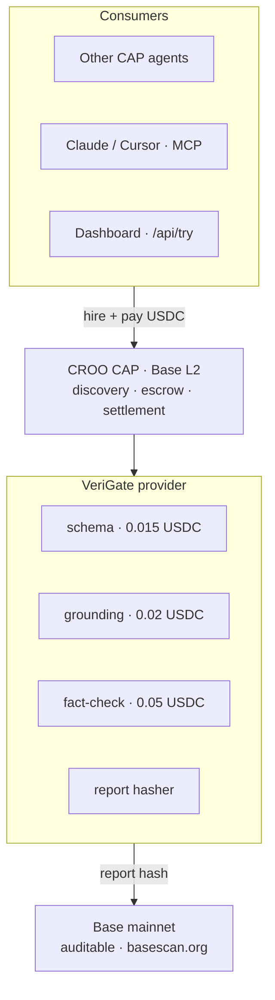
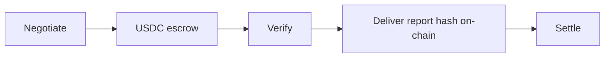
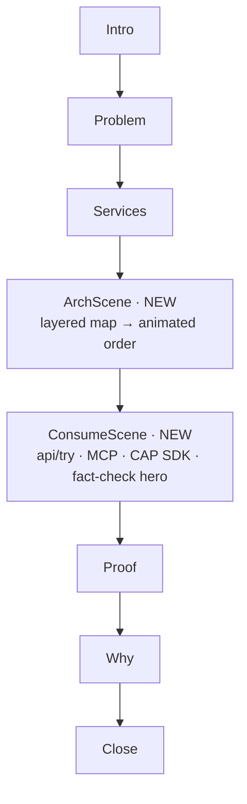
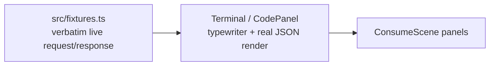

# Demo Video v2 — Architecture Flow + Live Agent-Consumption Demo - Plan

## Goal Capsule

- **Objective:** Rebuild the Remotion demo into a ~4-minute film that is more convincing than the current 58s cut by adding a layered architecture map (with one real CAP order animated through it) and a real agent-consumption demo showing the three ways to hire VeriGate — so a viewer finishes knowing exactly how to consume the agent.
- **Product authority:** wildanre (repo owner).
- **Open blockers:** none. Agent is live (`/health` → `ok`), `ELEVENLABS_API_KEY` is present in gitignored `.env`, and the Remotion project is preserved at `~/Desktop/verigate-demo-video-backup/`.

## Product Contract

*Product Contract changed: R6 reworded and R6b added (the free `/api/try` preview is off-chain — on-chain proof comes only from a real settled CAP order), R7 tightened, Flow F2/F3 split, Problem Frame and Dependencies clarified. Reason: doc review found that pairing `/api/try`'s `report_hash` with a basescan on-chain claim would be a fabricated demo. Change authorized by the user during the 2026-07-09 review. All other Product Contract content and IDs preserved.*

### Summary

A ~4-minute rebuild of the VeriGate demo video that inserts two new movements into the existing narrative spine: an **architecture flow** (layered system map, then a single real CAP order animated flowing through it) and a **consumption demo** (three real ways to hire VeriGate, rendered as animated terminals using verbatim live request/response data, with fact-check as the full hero call). The rendered MP4 is the DoraHacks deliverable and stays out of the public GitHub repo.

### Problem Frame

The current 58-second cut *tells* the viewer that VeriGate verifies agent outputs and settles on CAP, but it never *shows* the agent being consumed. For a hackathon judge, "hire an agent to check your agent" is only credible if they can see a real request go in and a real verdict come back, with genuine on-chain settlement shown for a real CAP order — and see the concrete ways a developer or another agent would actually call it. The video also under-explains the system: where the provider runs, how CAP sits between buyer and provider, and how a report hash lands on Base. Without an architecture flow and a live consumption demo, the video risks reading as "omong doang" (all talk) rather than proof.

### Key Decisions

- **Animated terminal with real captured data, not live screen recording.** Deterministic to render and fast to produce under a same-day deadline, while remaining 100% real request/response (captured verbatim from the live agent).
- **Depth over breadth on services.** Fact-check is shown as the full hero call; schema and grounding are named but not rendered in full, to keep the film at ~4 minutes.
- **Architecture = layered map, then animated order.** Present the stacked system map for "what runs where," then animate one CAP order flowing through it for "how it works" — one movement, two payoffs.
- **Rebuild from the local backup.** The working tree no longer contains `demo-video/` after the history rewrite; work resumes from `~/Desktop/verigate-demo-video-backup/`, and the folder stays gitignored.

### Requirements

**Length and structure**

- R1. Total runtime targets ~4 minutes (~240s) and must stay under CROO's 5-minute maximum.
- R2. The existing narrative spine is retained (intro → problem → services → how-it-works → proof → why → close) with two new movements inserted: an architecture flow and a consumption demo.

**Architecture flow**

- R3. The architecture movement first presents a layered system map: consumers (other CAP agents, Claude/Cursor via MCP, dashboard / free try) → CROO CAP on Base → VeriGate provider on Tencent Cloud (Docker + Caddy HTTPS) exposing the three services plus the report hasher → Base mainnet ledger.
- R4. The movement then animates a single real CAP order flowing through that map end to end: negotiate → USDC escrow → verify → deliver report hash on-chain → settle.

**Consumption demo**

- R5. The consumption movement shows three real ways to hire VeriGate as animated terminal/editor panels: the free `POST /api/try` preview, MCP inside Claude/Cursor, and hiring over CAP with the SDK requester.
- R6. Fact-check is the hero call shown in full via the free `/api/try` preview — request, then verdict + confidence + sources + `report_hash`. Schema and grounding are named but not shown in full.
- R6b. The free `/api/try` preview is presented honestly as **off-chain**: its `report_hash` is labeled a local integrity marker, with no basescan/on-chain claim attached. On-chain proof shown in the video comes only from a real settled CAP order — the CAP SDK panel's real delivery transaction and the Proof movement's real tx on basescan. Rationale: `/api/try` runs a verifier with no CAP order and writes nothing to Base; pairing its hash with an on-chain claim would be a fabricated demo (violates R7, DQ risk).
- R7. Every command and response on screen is captured verbatim from the live agent (real request, real report body, real `report_hash`) — no fabricated output. Any on-chain/basescan claim corresponds to a real settled order.

**Proof and narration**

- R8. The proof movement uses live metrics (56 delivered / 8 counterparty agents / 8 buyer wallets at capture time; actual values read at render — see U6) and the real delivery transaction, kept auditable on basescan.
- R9. The voiceover is regenerated (ElevenLabs) against a new script paced to the ~4-minute structure, with scene durations aligned so each scene holds through its narration line.

**Distribution**

- R10. The rendered MP4 is the DoraHacks submission deliverable; `demo-video/` remains excluded from the public GitHub repo (already gitignored).

### Key Flows

- F1. Film timeline (target ~240s; exact per-scene durations settled in planning)
  - **Trigger:** Video plays from frame 0.
  - **Steps:** Intro/hook → Problem ("agents act — who checks?") → Three services with prices → **Architecture map (R3)** → **Animated CAP order through the map (R4)** → **Consumption demo: `/api/try`, MCP, CAP SDK (R5, R6)** → Proof on Base mainnet (R8) → Why CAP not a plain API → Close / CTA.
  - **Outcome:** Viewer understands what VeriGate is, where it runs, how an order settles, and exactly how to consume it — backed by real data throughout.
  - **Covered by:** R1, R2, R3, R4, R5, R6, R8.

- F2. Hero fact-check call (inside the consumption demo)
  - **Trigger:** The free `/api/try` panel becomes active.
  - **Steps:** Real request types in → "running fact-check…" → real report renders (`verdict`, `confidence`, `sources`, `report_hash`) → `report_hash` labeled as an off-chain integrity marker (no basescan line here).
  - **Outcome:** The viewer sees a real verification produce a real verdict with sources.
  - **Covered by:** R6, R7.

- F3. On-chain proof (from a real settled order)
  - **Trigger:** The CAP SDK panel and the Proof movement.
  - **Steps:** Real hire-over-CAP order settles → real delivery transaction → `basescan.org` proof line and the Proof movement's real tx.
  - **Outcome:** The viewer sees genuine on-chain settlement — not attached to the free preview.
  - **Covered by:** R6b, R7, R8.

Architecture map (R3) — layered system:

Animated CAP order (R4) — order lifecycle traced through the map:

### Scope Boundaries

**Deferred for later**

- Royalty-free background music under the voiceover.
- Real dashboard / product screen footage.

**Outside this video's identity**

- Live screen recordings or Claude Desktop capture composited as footage — rejected in favor of animated terminals with real data.
- Rendering all three services as full hero calls — only fact-check is shown in full.

### Dependencies / Assumptions

- The agent stays live at `api-verigate.staifdev.codes` during data capture (`/health`, `/api/try`, `/api/metrics`).
- The deployed provider has a working LLM token (`ANTHROPIC_AUTH_TOKEN`/`ANTHROPIC_API_KEY`) and search backend during capture — the fact-check verifier requires both, and the provider disables fact-check entirely without an LLM token. If fact-check is unavailable at capture, fall back to a previously captured verbatim fixture rather than fabricating.
- Showing an MCP tool-call result or a CAP SDK delivery as a *real settled order* requires `CROO_SDK_KEY`, a funded requester wallet (~0.05 USDC/order), and a built MCP server. Where a funded settlement is not run, those panels display the real invocation shape plus the real `/api/try` fact-check response body for the result (still verbatim, still real) and reserve the on-chain/basescan proof for the existing settled delivery tx.
- `ELEVENLABS_API_KEY` remains available in gitignored `.env` for voiceover regeneration.
- The Remotion project is restored from `~/Desktop/verigate-demo-video-backup/` into the working tree to be worked on, and stays gitignored.
- `/api/try` request shape is `{ "service": <kind>, ...input }`; the schema verifier expects `expected_schema`. Exact request bodies and the real `report_hash` / delivery tx are captured at build time and may differ from any example values.
- Live metrics (56 / 8 / 8 at capture time) are read at render time (U6) and may have grown by then; the video uses whatever the API returns then.

### Outstanding Questions

**Deferred to implementation**

- Exact per-scene frame durations to land the film at ~240s (derived from measured VO segments in U5).
- Whether to reuse the existing "Brian" ElevenLabs voice or pick a new one for the longer script.

**Resolved during review (2026-07-09)**

- MCP panel content: shows the `mcp` config snippet (compact/static) plus the tool call — resolved in U4.
- Animated CAP order (R4): rebuilt inside `ArchScene` as beat 2 over the layered map; the standalone `FlowScene` is removed (KTD1, U5).
- On-chain proof source: only a real settled CAP order carries the basescan line; `/api/try` is off-chain (R6b).

**FYI — noted, not blocking (from 2026-07-09 doc review)**

- Timeline near-doubles content; per-panel legibility/fit is handled by U2's committed rules and confirmed against the real fixture size in U1/U4 rather than pre-budgeted here.

---

## Planning Contract

**Target project:** the Remotion app under `demo-video/remotion/` (currently absent from the working tree after the history rewrite; restored from `~/Desktop/verigate-demo-video-backup/` in U1). The folder stays gitignored — it is never committed; the rendered MP4 is uploaded to DoraHacks.

**Depth:** Standard. Six implementation units, dependency-ordered.

### Key Technical Decisions

- KTD1. Extend, do not rewrite. New scenes and UI primitives plug into the existing `Stage` / `theme` / `TransitionSeries` architecture in `demo-video/remotion/src/`. Six of the existing seven scenes are kept and re-paced (Intro, Problem, Services, Proof, Why, Close); the standalone `FlowScene` is absorbed into the new `ArchScene` (whose beat-2 animated order is the old flow content), and `ConsumeScene` is added. Net: **eight scenes**. Rationale: the existing motion system (springs, `Reveal`, `Bg`, camera drift) is already strong — reuse compounds it, and folding Flow into Arch avoids a redundant lifecycle scene.
- KTD2. Real data is captured once into a fixtures module and baked into the render, not fetched at render time. Rationale: Remotion renders must be deterministic and offline; capturing verbatim live request/response into `src/fixtures.ts` keeps the demo 100% real (R7) while keeping the render reproducible.
- KTD3. The architecture scene is two beats in one scene: a static layered system map, then an animated order token traversing it. Rationale: satisfies R3 + R4 in a single continuous movement; reuses the connector-draw and `FlowNode` ping-ring concepts already in `FlowScene`.
- KTD4. The voiceover is regenerated with ElevenLabs, and `DURATIONS` is re-derived from the new VO segment lengths so each scene holds through its narration line — the same pacing method used for the existing 58s cut. Rationale: audio drives scene length, not the reverse (R9).
- KTD5. Timeline target ~240s ≈ 7200 frames at 30fps, hard cap under 9000 frames (5 min, R1). Per-scene frame counts are derived from the measured VO segments in U5.

### High-Level Technical Design

Scene composition — two new movements inserted into the existing `TransitionSeries` (fade transitions unchanged):

Terminal primitive data flow (U2 + U4):

The architecture map (R3) and animated order (R4) diagrams are in the Product Contract Key Flows section above.

### Output note

No new directory hierarchy — all work lands in the existing `demo-video/remotion/src/` and `demo-video/remotion/public/`. Per-unit `**Files:**` are authoritative.

---

## Implementation Units

### U1. Restore project + capture real agent data into fixtures

- **Goal:** Get the Remotion project back into the working tree and freeze verbatim live agent data the demo will show.
- **Requirements:** R7; R8 (initial capture — final capture is U6's authority); enables U3, U4, U5.
- **Dependencies:** none.
- **Files:**
  - `demo-video/remotion/` (restored)
  - `demo-video/remotion/src/fixtures.ts` (new)
- **Approach:** Restore precisely so the final path matches the Files sections — the backup holds `remotion/` directly (no `demo-video/` wrapper): `mkdir -p demo-video && cp -R ~/Desktop/verigate-demo-video-backup/remotion demo-video/remotion` (folder stays gitignored). Then capture, verbatim, at build time:
  - (a) a `POST /api/try` fact-check request + its real report body including `verdict`, `confidence`, `sources`, `report_hash`. **Requires the provider's LLM + search backend to be live** (see Dependencies); if unavailable, reuse a previously captured verbatim fixture — never fabricate.
  - (b) representative `POST /api/try` requests for `schema` and `grounding` (named, not shown in full).
  - (c) the MCP tool-call **invocation shape** (config snippet + tool call) for the same fact-check; the displayed *result* reuses the real `/api/try` fact-check response body unless a funded settled order is run (see Dependencies).
  - (d) the CAP SDK requester **invocation shape** from `demo/requester.ts`; capture a real delivery tx only if a funded settled order is run, otherwise reference the existing settled delivery tx for the on-chain line.
  - (e) current `/api/metrics` (`completed`, `uniqueCounterparties`, `uniqueBuyers`) and the delivery tx.
  Store as typed constants in `src/fixtures.ts`. Record the request shape `{ service, ...input }` (schema verifier uses `expected_schema`).
- **Patterns to follow:** existing `VideoData` typing in `src/scenes.tsx`; `DATA` constant in `src/Root.tsx`.
- **Test scenarios:**
  - `curl` each captured request against the live API and confirm the stored response matches the real one (no fabricated fields).
  - `report_hash` in the stored fact-check fixture is a real `0x…` value returned by the API.
  - The captured fact-check `verdict` value and `sources` array are recorded so U2/U4 can style/size for the real values.
  - Metrics fixture equals the live `/api/metrics` at capture time.
- **Verification:** `src/fixtures.ts` compiles under the Remotion `tsconfig`; every fixture traces to a real captured response.

### U2. Animated terminal / code-panel UI primitives

- **Goal:** Reusable components that render a typewriter command line and a real JSON/code response with the brand look.
- **Requirements:** R5, R6, R7.
- **Dependencies:** U1 is a *soft* dependency (realistic preview content only). The primitives are pure functions of `frame` and can be built in parallel with U1 using placeholder content, then fed real fixtures.
- **Files:** `demo-video/remotion/src/ui.tsx` (extend)
- **Approach:** Add a `Terminal` component (window chrome, monospace, prompt, typewriter reveal keyed on `useCurrentFrame`, blinking caret) and a `CodePanel`/`ResultBlock` (renders captured JSON with accent keys, a "running…" state, then the result). The trailing proof line is a **prop, not hardcoded**: an off-chain preview shows `report_hash · off-chain integrity marker`, while a settled-order panel shows `✓ delivered on-chain · basescan.org`. Reuse `theme.mono`, `theme.accent`, existing `Caret`, `clampO`, and `EASE_OUT`. Support a `startFrame`/`speed` prop so panels can be sequenced.
  - **Verdict styling:** the `ResultBlock` styles the fact-check verdict by value — accent-green for a passing/`true` verdict, `theme.danger` for `false`, `theme.warn` for `partial`/`misleading`/`unverified` — with a matching icon. Build it for whatever verdict U1 actually captured.
  - **Legibility rules (commit, don't defer):** show at most N source URLs (with `+X more` when the real array is longer), render URLs domain-only or middle-ellipsis, hold a minimum monospace body size, and wrap within safe margins. Confirm N against the real captured `sources` count from U1.
  - **`report_hash` rendering:** truncated middle-ellipsis (`0x` + first 6 … last 4) on the result line at a fixed monospace size that fits the panel width.
- **Patterns to follow:** existing `Caret`, the typewriter slice in `ProofScene` (`full.slice(0, chars)`), `Pop`/`Reveal` primitives.
- **Test scenarios:**
  - `Terminal` reveals characters progressively and stops at full text (no overflow past string length).
  - `ResultBlock` shows the "running" state before `startFrame + delay`, then the parsed real JSON.
  - The verdict renders in the correct color/icon for a `true`, `false`, and `partial` value.
  - A `sources` array longer than N renders `+X more` and stays within safe margins; `report_hash` renders middle-ellipsis without overflow.
  - The proof-line prop renders the off-chain marker vs the on-chain basescan line correctly.
- **Verification:** rendered stills at mid-typing and post-result frames look correct; components are pure functions of `frame` (deterministic).

### U3. Architecture scene — layered map then animated order

- **Goal:** New scene: layered system map (R3), then a single order animated flowing through it (R4).
- **Requirements:** R3, R4.
- **Dependencies:** U1.
- **Files:** `demo-video/remotion/src/scenes.tsx` (add `ArchScene`)
- **Approach:** Beat 1 — draw the four tiers (Consumers → CROO CAP/Base → VeriGate provider on Tencent with the 3 services + report hasher → Base ledger) with staggered `Reveal`/`Pop` and drawing connectors. Beat 2 — a glowing order token animates top-to-bottom through the tiers with stage labels (negotiate → escrow → verify → deliver → settle), reusing `FlowNode` ping-ring and connector-draw concepts. Prices (0.015 / 0.02 / 0.05 USDC) shown on the service nodes.
  - **Beat transition (commit):** the full map persists (dimmed to ~60%) while the order token traverses; the active tier/stage highlights as the token passes. Define a frame split between the reveal beat and the traversal beat.
  - **Information architecture (reveal order):** kicker → tier labels top-down → connectors → order token.
  - **Layout budget (commit):** fixed tier-band heights, node min/max width, a two-line/shortened rule for long labels (e.g. "VeriGate provider · Tencent Cloud · Docker + Caddy HTTPS"), and a minimum label font size — verified against the longest actual label.
- **Patterns to follow:** `FlowScene` connector-draw (`interpolate(frame,[16,70],[0,1])`), `FlowNode`, `Kicker`, `Stage seed=`.
- **Test scenarios:**
  - All four tiers and the three service nodes render and are readable at the committed font floor; the longest provider label does not overflow.
  - The map dims and the order token traverses all stages within the scene's frame budget, with the active tier highlighted.
  - Covers R3, R4.
- **Verification:** rendered stills at the map beat and at 2–3 order-traversal frames match the Product Contract diagrams.

### U4. Consumption demo scene — three real ways + fact-check hero

- **Goal:** New scene showing `/api/try`, MCP, and CAP SDK as animated terminals, with fact-check shown in full (R6), and on-chain proof shown only for the real settled order (R6b).
- **Requirements:** R5, R6, R6b, R7.
- **Dependencies:** U1, U2.
- **Files:** `demo-video/remotion/src/scenes.tsx` (add `ConsumeScene`)
- **Approach:** Three sequenced panels using U2 primitives, each fed from `src/fixtures.ts`:
  - (1) free `POST /api/try` — the **hero call**: real request typed, real fact-check report rendered (`verdict`, `confidence`, `sources`, `report_hash`), with the trailing line = off-chain integrity marker (**no basescan claim** — R6b).
  - (2) MCP in Claude/Cursor — the `mcp` config snippet shown **compact/static (not typewritten)** plus the tool call; the result reuses the real fact-check response body.
  - (3) CAP SDK requester — the real hire-over-CAP invocation; this panel (a real settled order) carries the `✓ delivered on-chain · basescan.org` line with the real delivery tx.
  - Schema and grounding named in a small caption, not shown in full.
  - **Panel sequencing (commit):** one panel visible at a time, replace-in-place with a short crossfade between panels; each panel holds after its result renders, with the hero `/api/try` panel holding longest so the full report is readable before exit.
  - **Information architecture:** "three ways to hire" kicker → panel chrome → typed request → result, repeated per panel.
- **Patterns to follow:** `ServiceRow` sequencing/stagger; `Caption`; `Kicker`.
- **Test scenarios:**
  - Each of the three panels appears in sequence (replace-in-place, crossfade) and shows a real captured request; the hero panel holds longest.
  - The fact-check panel renders `verdict` + `confidence` + `sources` + `report_hash` with the off-chain marker and **no** basescan line (Covers R6, R6b).
  - The CAP SDK panel shows the on-chain basescan line with the real delivery tx (Covers R6b).
  - No fabricated output — every value traces to `src/fixtures.ts` (Covers R7).
  - Schema and grounding are named but not rendered as full calls.
- **Verification:** rendered stills of all three panels; hero panel shows the full real fact-check report off-chain; CAP SDK panel shows the real on-chain tx.

### U5. Regenerate voiceover + re-pace timeline

- **Goal:** New ~4-min narration, regenerated audio, and `DURATIONS` re-derived so scenes hold through narration; new scenes wired into the series.
- **Requirements:** R1, R2, R9.
- **Dependencies:** U3, U4.
- **Files:**
  - `demo-video/remotion/public/voiceover.txt` (new script)
  - `demo-video/remotion/public/voiceover.mp3` (regenerated)
  - `demo-video/remotion/src/VeriGateVideo.tsx` (remove `FlowScene` from the series, insert `ArchScene` + `ConsumeScene`; update `DURATIONS` to eight entries)
- **Approach:** Write a narration script with a beat per scene including the two new movements (architecture: "here's what actually runs and how one order settles"; consumption: "and here's how you call it — three ways, real responses"). Generate via ElevenLabs using `ELEVENLABS_API_KEY` from `.env` (curl with system certs, per prior run). Measure each VO segment; set `DURATIONS` (frames at 30fps) so each scene spans its line; total ≈ 7200 frames, under the 9000 hard cap. Insert the two scenes into the `TransitionSeries` in the order shown in the HTD.
- **Patterns to follow:** existing `DURATIONS`/`TOTAL_FRAMES` derivation and the `Audio src={staticFile('voiceover.mp3')}` wiring in `VeriGateVideo.tsx`.
- **Test scenarios:**
  - `TOTAL_FRAMES` ≥ audio length in frames (audio not cut off) and < 9000 (Covers R1).
  - Eight scenes present in the series in HTD order — `FlowScene` removed, `ArchScene` + `ConsumeScene` inserted (Covers R2).
  - Each scene's duration ≥ its narration segment length (Covers R9).
- **Verification:** preview in Remotion Studio shows narration aligned to each scene; no scene ends mid-sentence.

### U6. Render, verify, refresh backup

- **Goal:** Produce the final MP4 and confirm it meets the contract.
- **Requirements:** R1, R8, R10.
- **Dependencies:** U5.
- **Files:** `demo-video/remotion/out/verigate-demo.mp4` (rendered; gitignored)
- **Approach:** U6 is the single authority for R8's shipped figures: re-capture live metrics/tx immediately before render and update `src/Root.tsx` `DATA` + fixtures if changed (U1's capture is provisional). Render at 1920×1080/30fps with audio. Confirm runtime, audio sync, and that no demo artifact is staged for git. Copy the final project + MP4 back to `~/Desktop/verigate-demo-video-backup/` for the DoraHacks upload.
- **Patterns to follow:** existing render/output setup in `demo-video/remotion/`.
- **Test scenarios:**
  - `git status` shows no `demo-video/` files staged or tracked (Covers R10).
  - Rendered MP4 runtime is ~240s and under 5:00 (Covers R1).
  - Audio plays to the end without truncation; proof numbers match capture-time metrics (Covers R8).
- **Verification:** play the MP4 end-to-end; `ffprobe`/duration check confirms length; `git status` confirms exclusion.

---

## Verification Contract

| Gate | How | Applies to |
|---|---|---|
| Type-check | Remotion project compiles (`tsc` via the project `tsconfig`) | U1, U2, U3, U4, U5 |
| Fixture authenticity | Each fixture re-verified against the live API; `report_hash` real | U1, U4 |
| Visual stills | Render boundary/mid-scene stills and eyeball against diagrams | U2, U3, U4 |
| Timeline | `TOTAL_FRAMES` < 9000 and ≥ audio frames; eight scenes in order | U5 |
| On-chain honesty | `/api/try` panel shows no basescan claim; basescan line only on the real settled-order panel | U4 |
| Final render | Full MP4 plays with synced audio at 1920×1080/30fps | U6 |
| Git exclusion | `git status` shows no `demo-video/` tracked or staged | U6 |

---

## Definition of Done

- A ~4-minute (≈240s, under 5:00) MP4 renders with synced regenerated voiceover.
- The video includes the layered architecture map and an animated CAP order flowing through it (R3, R4).
- The consumption movement shows `/api/try`, MCP, and CAP SDK with fact-check as a full real hero call; schema and grounding named (R5, R6).
- The free `/api/try` preview carries no on-chain/basescan claim; the basescan proof line appears only on the real settled-order panel and the Proof movement (R6b).
- Every on-screen request/response traces to a verbatim live capture in `src/fixtures.ts` (R7).
- Proof figures reflect metrics captured at render time (R8).
- `demo-video/` remains untracked/gitignored; the MP4 exists locally for DoraHacks upload (R10).
